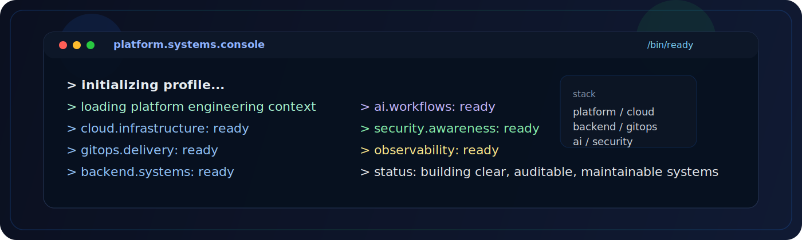
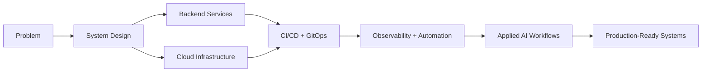

# Syed Tashfin

  

**Platform Engineering · Cloud Infrastructure · DevOps · Backend Systems · Applied AI**

Paris, France

[Portfolio](https://syedtashfin.com) · [LinkedIn](https://www.linkedin.com/in/syed-mostafa)

## Intro

I build practical engineering systems across infrastructure, backend services, automation, and AI workflows. My focus is on systems that are understandable, auditable, deployable, and maintainable once they are in real use.

I care about the path from problem to system design to delivery. That means clear architecture, reliable operations, and technical choices that are easy to explain to teammates, interviewers, and stakeholders.

## System map

## Engineering focus

| Area | What I work on |
| --- | --- |
| Platform Engineering | Internal platforms, deployment workflows, infrastructure patterns, and the systems that help teams ship reliably. |
| Cloud & DevOps | Containers, CI/CD, GitOps, infrastructure automation, and operational tooling. |
| Backend Systems | APIs, services, data flow, authentication, integration logic, and maintainable application design. |
| Applied AI | Local LLM workflows, structured automation, orchestration, and practical AI systems that fit into operations. |
| Security-Aware Engineering | Compliance-minded design, evidence tracking, safer defaults, and systems that are easier to audit. |
| Technical Education | Teaching, explanation, mentoring, and turning technical work into something other people can use and understand. |

## Selected projects

| Project | What it demonstrates |
| --- | --- |
| [AtouPay](https://github.com/SyedTashfin/AtouPay) | Payment-first rental platform work that shows product thinking across mobile and backend delivery; technical focus: Expo, Fastify, TypeScript, product engineering. |
| [ISO-27001-Web-App](https://github.com/SyedTashfin/ISO-27001-Web-App) | ISO 27001 learning tooling built around evidence, audit thinking, nonconformity practice, and mock-exam prep; technical focus: Next.js and compliance-minded UX. |
| [Outsight-MultiTenant-GitOps-Lab](https://github.com/SyedTashfin/Outsight-MultiTenant-GitOps-Lab) | Multi-tenant Kubernetes lab showing CI/CD, GitOps, and observability in one system; technical focus: Kubernetes, GitOps, and operational delivery. |
| [Local-Multi-LLM-Orchestrator](https://github.com/SyedTashfin/Local-Multi-LLM-Orchestrator) | Local-first multi-LLM orchestration with review and ranking; technical focus: local models, coordination, and workflow design. |
| [Cloud-Analytics-ML-Pipeline](https://github.com/SyedTashfin/Cloud-Analytics-ML-Pipeline) | Reproducible analytics pipeline that highlights data processing and output automation; technical focus: PySpark, feature engineering, dashboards. |
| [Freelance-Teaching](https://github.com/SyedTashfin/Freelance-Teaching) | Teaching-service microsite and educator portfolio work; technical focus: web presence, communication, and service positioning. |

## What this profile demonstrates

- Turning ideas into working systems
- Backend and infrastructure understanding
- Deployment and GitOps thinking
- Security and compliance awareness
- Documentation and teaching ability

## Roles I am targeting

- Platform Engineer
- DevOps Engineer
- Cloud Engineer
- Backend Engineer
- DevSecOps Engineer
- Applied AI Systems Engineer

## Current direction

My current direction is cloud-native infrastructure, GitOps and platform workflows, backend reliability, AI-assisted engineering systems, and security and compliance automation.

## Contact

- Portfolio: [syedtashfin.com](https://syedtashfin.com)
- LinkedIn: [linkedin.com/in/syed-mostafa](https://www.linkedin.com/in/syed-mostafa)

