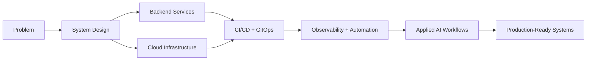

# Syed Tashfin

**Platform Engineering · Cloud · DevOps · Backend Systems · Applied AI**

Paris, France

[Portfolio](https://syedtashfin.com) · [LinkedIn](https://www.linkedin.com/in/syed-mostafa) · [GitHub](https://github.com/SyedTashfin)

## Intro

I build production-oriented systems across infrastructure, backend services, automation, and AI workflows. My focus is on work that is understandable, auditable, deployable, and maintainable once it reaches real users and real operations.

I care about the handoff from idea to system: design, delivery, observability, and the operational details that keep software reliable. I also bring a teaching and communication background, which helps when explaining technical decisions clearly to both engineers and non-engineers.

## System map

## Engineering focus

| Area | What I work on |
| --- | --- |
| Platform Engineering | Internal platforms, deployment workflows, infrastructure patterns, and the systems that help teams ship reliably. |
| Cloud & DevOps | Containers, CI/CD, GitOps, infrastructure automation, and operational tooling. |
| Backend Systems | APIs, services, data flow, authentication, integration logic, and maintainable application design. |
| Applied AI | Local LLM workflows, structured automation, orchestration, and practical AI systems that fit into operations. |
| Security-Aware Engineering | Compliance-minded design, evidence tracking, safer defaults, and systems that are easier to audit. |
| Technical Education | Teaching, explanation, mentoring, and turning technical work into something other people can use and understand. |

## Selected projects

| Project | What it demonstrates | Technical focus |
| --- | --- | --- |
| [AtouPay](https://github.com/SyedTashfin/AtouPay) | A payment-first rental platform that shows product thinking across mobile and backend delivery. | Expo, Fastify, TypeScript, product engineering |
| [ISO-27001-Web-App](https://github.com/SyedTashfin/ISO-27001-Web-App) | An ISO 27001 learning app built around evidence, audit thinking, nonconformity practice, and mock-exam prep. | Next.js, learning workflow, compliance-minded design |
| [Outsight-MultiTenant-GitOps-Lab](https://github.com/SyedTashfin/Outsight-MultiTenant-GitOps-Lab) | A multi-tenant Kubernetes lab that shows CI/CD, GitOps, and observability in one system. | Kubernetes, GitOps, CI/CD, observability |
| [Local-Multi-LLM-Orchestrator](https://github.com/SyedTashfin/Local-Multi-LLM-Orchestrator) | A local-first multi-LLM system that demonstrates structured orchestration and model coordination. | Local LLMs, ranking, review, workflow orchestration |
| [Cloud-Analytics-ML-Pipeline](https://github.com/SyedTashfin/Cloud-Analytics-ML-Pipeline) | A reproducible analytics pipeline that highlights data processing and output automation. | PySpark, feature engineering, dashboards |
| [Freelance-Teaching](https://github.com/SyedTashfin/Freelance-Teaching) | A teaching-service microsite that reflects communication, presentation, and online presence work. | Web presence, education, service positioning |

## What this profile demonstrates

- Moving from idea to working system
- Backend, deployment, infrastructure, and automation knowledge
- Security and compliance awareness
- Documentation and teaching ability
- Production-oriented thinking

## Roles I am targeting

- Platform Engineer
- DevOps Engineer
- Cloud Engineer
- Backend Engineer
- DevSecOps Engineer
- Applied AI Systems Engineer

## Current direction

My current focus is on cloud-native infrastructure, GitOps and platform workflows, backend reliability, AI-assisted engineering systems, and security/compliance automation.

## Contact

- Portfolio: [syedtashfin.com](https://syedtashfin.com)
- LinkedIn: [linkedin.com/in/syed-mostafa](https://www.linkedin.com/in/syed-mostafa)
- GitHub: [github.com/SyedTashfin](https://github.com/SyedTashfin)

## Contribution snake

