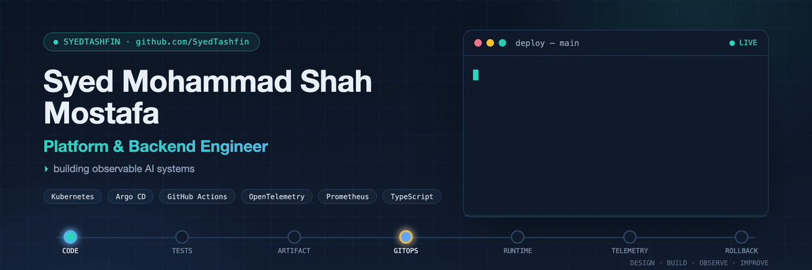

<div align="center">

[](https://syedtashfin.com/case-studies/cicd-gitops-multitenant-kubernetes-saas)

# Syed Mohammad Shah Mostafa (Tash)

### Platform & Backend Engineer — building observable AI systems

Paris, France · Targeting English-speaking platform, backend, cloud and AI-platform roles

[Portfolio](https://syedtashfin.com) · [Engineering brief](assets/from-commit-to-observable-rollback.pdf) · [Case studies](https://syedtashfin.com/case-studies) · [LinkedIn](https://www.linkedin.com/in/syed-mostafa) · [Email](mailto:syed@syedtashfin.com)

</div>

## What I do

Platform and backend engineer, focused on backend services, CI/CD and GitOps delivery, Kubernetes controls, telemetry, and AI systems that run on local infrastructure rather than external APIs. Work follows a single delivery path, so everything can be reviewed, released, observed and rolled back:

```text
code → tests → immutable artifact → reviewed GitOps → runtime → telemetry → rollback
```

Public work is grouped below by domain; each project is labeled by scope so the evidence stays honest.

## Key case studies

The strongest proof is in the written studies — each maps a real system to what was built, how it was verified, and what it cost:

- **[LC Website & Network Security Hardening](https://syedtashfin.com/case-studies/lc-website-security-hardening)** — audit → remediation → verification on LC's production Next.js platform: retired the live HTML uploader, sandboxed embedded content, bounded the lead APIs, 13/13 hardened tests.
- **[Linguistic Communication — Public Platform, LC Academy & Operations](https://syedtashfin.com/case-studies/linguistic-communication-edtech)** — WordPress → versioned Next.js catalogue (299 SSG pages), staging/prod delivery on one VPS, and the LC Academy multi-agent classroom.
- **[Multi-Tenant GitOps Platform](https://syedtashfin.com/case-studies/cicd-gitops-multitenant-kubernetes-saas)** — CI → immutable image → reviewed GitOps → Argo CD → Prometheus-gated rollouts → rollback, on a multi-tenant Kubernetes model.
- **[Secure Teacher Onboarding & Document Pipeline](https://syedtashfin.com/case-studies/secure-teacher-onboarding-document-pipeline)** — NAS + Cloudflare + local-API document pipeline for LC teacher onboarding.
- **[OpsPilot — Local-First AI Operations Copilot](https://syedtashfin.com/case-studies/opspilot-local-first-ai-operations-copilot)** — RAG over runbooks with bounded, fail-closed LLM calls and Langfuse tracing.
- **[LLM Council — Local Multi-LLM Orchestrator](https://syedtashfin.com/case-studies/llm-council-local-multi-llm-orchestrator)** — local Ollama inference behind an authenticated gateway, anonymized peer review and chairman synthesis.

## Platform & delivery

| Project | Scope | Engineering signal |
| --- | --- | --- |
| [Multi-Tenant GitOps Platform Lab](https://github.com/SyedTashfin/Outsight-MultiTenant-GitOps-Lab) | Production-style lab | GitHub Actions, multi-arch GHCR images, Helm overlays, Argo CD reconciliation, Prometheus-gated Argo Rollouts, RBAC, NetworkPolicy, Grafana + Loki. [Case study](https://syedtashfin.com/case-studies/cicd-gitops-multitenant-kubernetes-saas) |
| [Cloud Analytics ML Pipeline](https://github.com/SyedTashfin/Cloud-Analytics-ML-Pipeline) | Production-style data lab | Config-driven PySpark ingestion, feature engineering, MLlib training/evaluation, dashboard artifacts, local-to-GCP Dataproc parity. |
| LC production infrastructure | Employer org — documented | WordPress → versioned Next.js/TypeScript catalogue (299 SSG pages), separate staging/prod GitHub Actions paths on one VPS, incident recovery. Covered in the [engineering brief](assets/from-commit-to-observable-rollback.pdf). |

## Backend, local AI & agent systems

A recurring thread is **local AI**: self-hosted inference (Ollama serving a 30B Qwen model) behind an authenticated OpenAI-compatible gateway bound to loopback, agent workflows orchestrated through Hermes gateways — including fixing a tool-call defect and validating real agent tool execution — and bounded workflows built on LangGraph and LangChain rather than dependent on external inference APIs.

| Project | Scope | Engineering signal |
| --- | --- | --- |
| [Thales Optronic Video Indexing](https://github.com/SyedTashfin/Thales-optronic-video-indexing) | Academic collaboration | FastAPI, Celery/Redis, frame sampling, YOLO, OCR, Whisper transcription, semantic search, JSON/PDF/CSV reporting. |
| [Local Multi-LLM Orchestrator](https://github.com/SyedTashfin/Local-Multi-LLM-Orchestrator) | Personal systems project | Local Ollama services (30B Qwen), anonymized peer review, chairman synthesis, strict JSON/Zod contracts, SQLite run history, health/latency observability. |
| [OpsPilot](https://github.com/SyedTashfin/OpsPilot) | Personal systems project | Local-first RAG operations copilot: evidence collection across logs/metrics/deployments/runbooks, bounded structured LLM calls, persisted investigation steps, Ollama/Gemini provider boundaries, typed contracts, fail-closed validation, Langfuse tracing. |
| [LC Academy (OpenMAIC)](https://github.com/linguisticcom/OpenMAIC) | Employer org — deployed | AI-assisted multi-agent classroom adapted from an open-source system, with organisation-aware access control and teacher review/publishing workflows. |

## Security engineering

| Project | Scope | Engineering signal |
| --- | --- | --- |
| [ISO 27001 Lab](https://github.com/SyedTashfin/ISO-27001-Web-App) | Deployed learning product | Bilingual Next.js platform for evidence, risk treatment, SoA, audit, nonconformity, Annex A controls, mock-exam practice. |
| [Lightweight Authentication for LIN/CAN Probes](https://github.com/SyedTashfin/Lightweight-Authentication-for-LIN-CAN-Probes) | Research prototype | Message-authentication scheme for automotive LIN/CAN buses. |
| [Bangladesh E-Voting](https://github.com/SyedTashfin/Bangladesh-E-Voting) | Research prototype | Blockchain e-voting with Solidity, React and Web3.js — cast-as-intended integrity. |

## Products & apps

| Project | Scope | Engineering signal |
| --- | --- | --- |
| [ATouPay](https://github.com/SyedTashfin/AtouPay) | Product MVP | Expo/React Native client, Fastify API, Firebase identity/data, backend-owned critical writes, receipts, recovery, provider boundary for payments. |
| [SyntaxMap](https://github.com/SyedTashfin/Syntax-Map) | Teaching product | Interactive classroom tool for English grammar practice, built and used at Linguistic Communication. |

## Open-source

Early in the contribution cycle — no upstream merge has landed yet, and that is stated plainly rather than implied otherwise. Two implementation PRs are open and awaiting maintainer review:

- **[OpenTelemetry JS contrib PR #3751](https://github.com/open-telemetry/opentelemetry-js-contrib/pull/3751)** — new `@opentelemetry/instrumentation-long-animation-frame` package, the Long Animation Frames successor to the deprecated long-task instrumentation. Built to unblock [PR #3669](https://github.com/open-telemetry/opentelemetry-js-contrib/pull/3669), the long-task deprecation a maintainer reviewed and asked for this replacement to precede. CLA signed.
- **[Grafana MCP PR #1166](https://github.com/grafana/mcp-grafana/pull/1166)** — fix for the stdio transport not re-reading `GRAFANA_SERVICE_ACCOUNT_TOKEN_FILE` after startup ([#987](https://github.com/grafana/mcp-grafana/issues/987)), with a token-rotation regression test.

Process: reproduce the issue → propose a focused change → sign the CLA → iterate with maintainers → land. Scope is logged honestly so nothing is presented as merged before it is.

## Security hardening

A proportionate security baseline applied to Linguistic Communication's public Next.js platform, validated in staging then production:

- **Retired the live HTML uploader** in favour of Git-reviewed publication.
- **Sandboxed embedded content** without `allow-same-origin`.
- **Bounded the two lead APIs** (`quiz-lead`, `b2b-diagnostic-lead`): content-type checks, 64 KB body cap, field/array limits.
- **Bot and abuse controls:** honeypot, minimum completion time, short-window duplicate suppression, SMTP rate limits.
- **Edge identity and headers:** trusted client-IP restoration behind Cloudflare, baseline security headers, CSP report-only, disabled `X-Powered-By`, Nginx body/rate limits, `security.txt` + data-handling policy.
- **Evidence:** a baseline-vs-hardened scenario harness (13/13 hardened tests pass; primary runtime/static classes 1/14 → 14/14) plus staging and production validation.

Full write-up: [LC Website & Network Security Hardening — audit → remediation → verification](https://syedtashfin.com/case-studies/lc-website-security-hardening).

## Engineering focus

| Platform delivery | Backend systems | Observability & AI |
| --- | --- | --- |
| Linux · Docker · Kubernetes · Helm · Argo CD · GitHub Actions | TypeScript · Python · FastAPI · Fastify · PostgreSQL | OpenTelemetry · Prometheus · Grafana · LangGraph · LangChain · RAG · pgvector · Ollama |

## Useful review paths

- **Platform / cloud:** the [six-page engineering brief](assets/from-commit-to-observable-rollback.pdf), then the [GitOps case study](https://syedtashfin.com/case-studies/cicd-gitops-multitenant-kubernetes-saas).
- **Backend / local AI systems:** [Thales Video Indexing](https://github.com/SyedTashfin/Thales-optronic-video-indexing), the [Local Multi-LLM Orchestrator](https://github.com/SyedTashfin/Local-Multi-LLM-Orchestrator) and [LC Academy (OpenMAIC)](https://github.com/linguisticcom/OpenMAIC).
- **Security-aware engineering:** [ISO 27001 Lab](https://github.com/SyedTashfin/ISO-27001-Web-App) and the [LC production hardening](#security-hardening) above.
- **Broader evidence:** the [portfolio evidence map](https://syedtashfin.com/evidence-map).

<div align="center">


</div>
